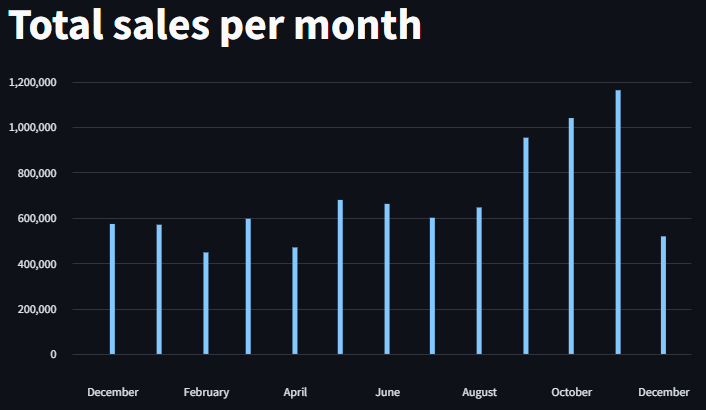
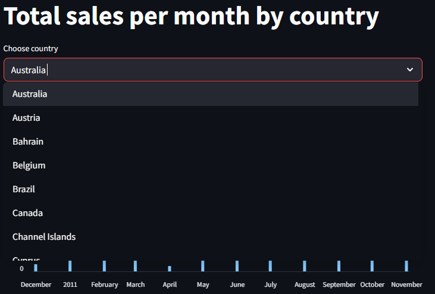
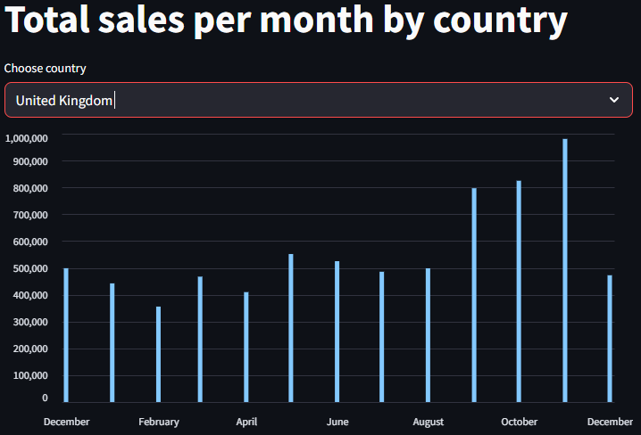
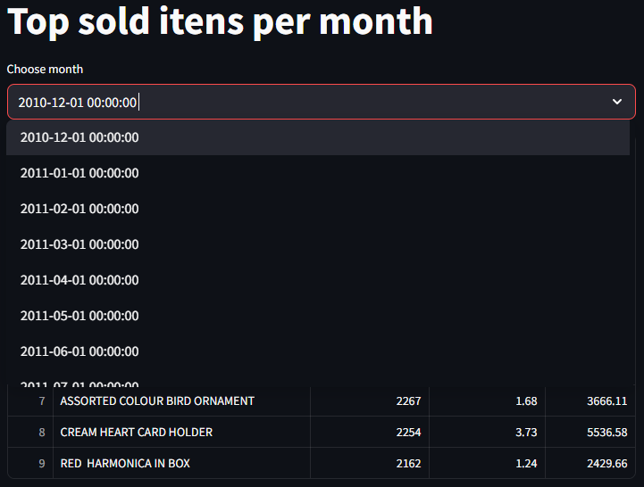
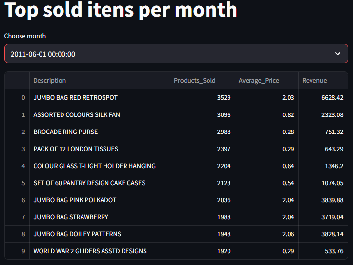

# ECommerce

## Descrição
Utilizei um [dataset](https://www.kaggle.com/datasets/carrie1/ecommerce-data) de Ecommerce do Kaggle para este projeto, onde coloquei como objetivo a realização de um ETL para a carga no DuckDB. As etapas deste projeto foram:

### 1. Leitura do arquivo:
- O arquivo foi lido, e carregado em um dataframe utilizando Pandas;
- O Pandera foi utilizado para validar os dados. Informações que estão fora do padrão foram descartadas;
- Utilizei o Pytest para validar os tratamentos;

### 2. Criação de novas colunas:
- A coluna 'Total' foi criada para verificar o valor gasto naquele registro, sendo a quantidade de itens vendidos multiplicado pelo valor unitário do item;
- A coluna 'MonthSale' é o mês daquela compra

### 3. Inserção de dados:
- A inserção dos dados é feito através do DuckDB, salvando em um arquivo: ecommerce.db

### 4. Visualização de Dados:
- Foi utilizado o Streamlit para a visualização dos dados:

### CI
- A branche main foi bloqueada para push. Utilizo a branche develop e pull request. Além de uma etapa de CI:

### Taskipy

COloquei no projeto o taskipy para facilitar a execução de comandos comuns durante o desenvolvimento. Abaixo estão as tarefas disponíveis:

poetry run task <nome_da_tarefa>
Tarefas disponíveis
| Tarefa | Descrição |
| --- | --- |
| lint | Executa o linter ruff para verificar problemas de formatação e estilo. |
| pre_format | Corrige automaticamente problemas detectados pelo ruff. |
| format | Aplica o estilo de formatação definido (ruff format). |
| pre_run | Executa o script main.py para processar e carregar os dados. |
| run | Inicia a aplicação com Streamlit (ecommerce/app.py). |
| pre_test | Executa o lint automaticamente antes dos testes. |
| test | Executa os testes usando pytest em modo verboso. |

Observação: as tarefas pre_run e pre_test são chamadas automaticamente antes das tarefas run e test, respectivamente.

## Estrutura de Diretórios
<pre lang="markdown"><code>.
├── README.md                 # Documentação principal do projeto
├── .gitignore                # Arquivos e pastas ignorados pelo Git
├── .python-version           # Versão do Python utilizada
├── poetry.lock               # Arquivo de bloqueio de dependências
├── pyproject.toml            # Configuração do projeto e dependências
├── data/
│   ├── data.csv              # Conjunto de dados de entrada
│   └── pipeline/
│       └── ecommerce.db      # Arquivo destino (Base DuckDB)
├── ecommerce/
│   ├── main.py               # Script principal da aplicação
│   ├── schema.py             # Definições de schemas e validações
│   └── pipeline/
│       ├── extract.py        # Funções de extração de dados
│       ├── load.py           # Funções para carregar dados
│       └── transform.py      # Funções de transformação de dados
├── tests/
│   └── test_read_file.py     # Testes para leitura de arquivos
└── .github/
    └── workflows/
        └── CI.yaml           # CI com GitHub Actions
</code></pre>

## Imagens

### Vendas no mês

### Venda mensal por país

### Produtos mais vendidos por mês

